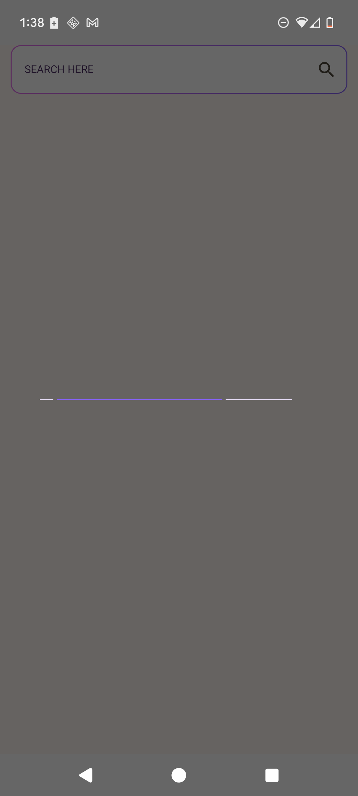
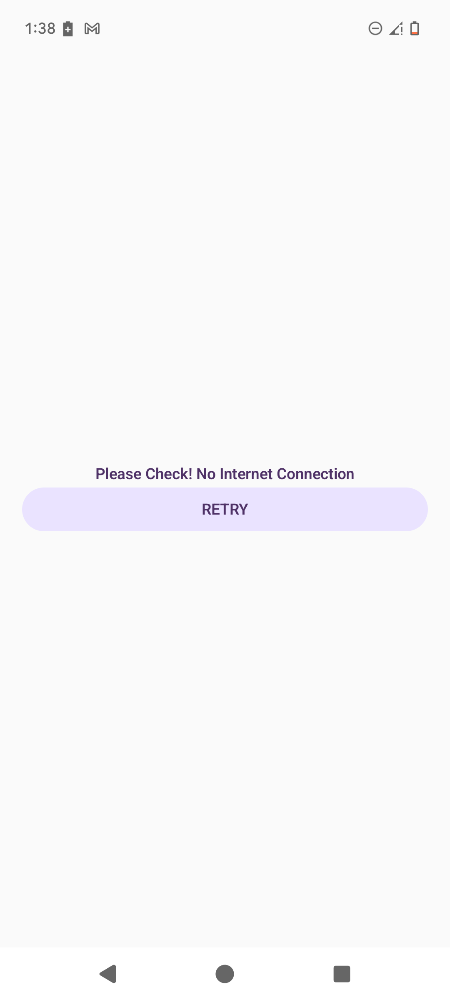
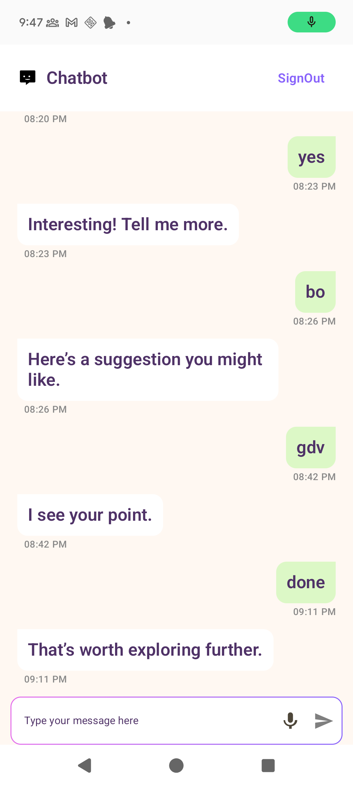
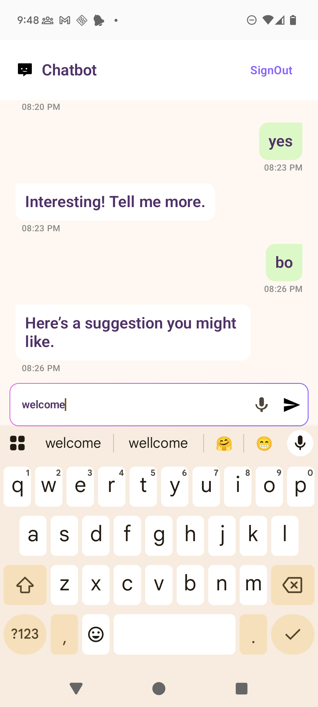
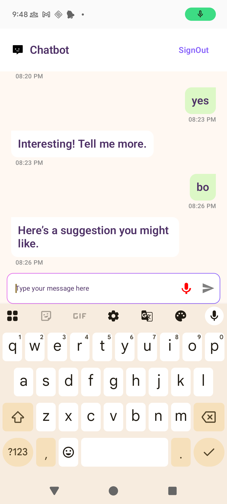
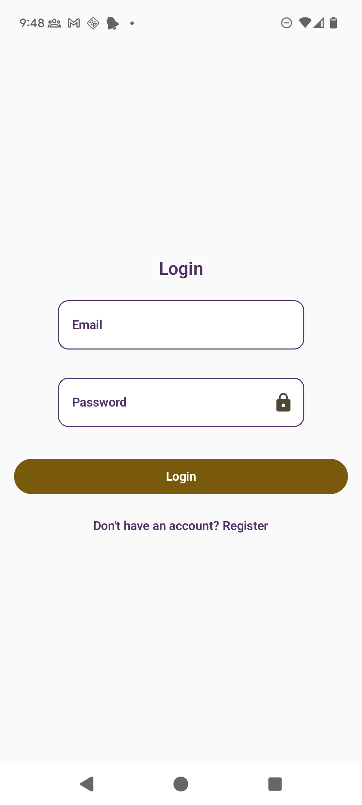
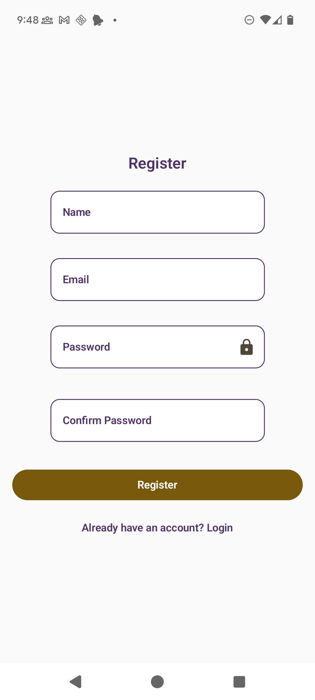

/**
App Name: ChatBot Compose
Description:
This app demonstrates a chat application with Firebase Authentication, offline caching,
speech recognition, and network monitoring — all built with Jetpack Compose.  
It supports login, registration, voice input, and displays old chat history from RoomDB cache.  
The app listens for live network changes and gracefully handles offline scenarios.

Key Features:
- Firebase Authentication for Login & Registration
- Room local database for chat history caching
- Speech recognition with runtime microphone permission requests
- Network monitoring and No Network screen
- Auto-restore last screen based on login state
  */

# ChatBot Compose
A Kotlin-based Android app for chatting with a bot, featuring Firebase Auth for user management, RoomDB for local chat caching, offline handling, and speech input capabilities.

---

## 📱 Chat + Offline Caching + Voice Input
An Android app built using Jetpack Compose, showcasing:
- Firebase Authentication for login & register
- Room for storing old chat conversations
- SpeechRecognizer API for voice-to-text input
- Network monitoring for offline handling

---

## 🧱 Architecture Overview
This app follows a layered architecture:

**UI Layer**: Jetpack Compose + ViewModel  
**Data Layer**: Repository Pattern  
**Local Caching**: Room Database  
**Authentication**: Firebase Auth  
**Voice Input**: Android SpeechRecognizer API  
**Network Monitoring**: ConnectivityManager with callbackFlow

---

## 🚀 Features
- Firebase Email/Password Login & Registration
- Caching of chat messages using Room
- Retrieval of old conversation history after login
- Speech-to-text input with mic permission handling
- No Network screen when offline
- Auto-restore chat screen after network returns
- Hardcoded chatbot replies for demo purposes

---

## Setup Instructions

1. **Clone the repository**
   ```bash
   git clone https://github.com/your-repo-link.git
   cd your-project-folder
   ```
2. **Open in Android Studio**
Open the cloned project in Android Studio (latest stable version recommended).

3. **Firebase Setup**
Go to Firebase Console
Create a new Firebase project.
Add an Android app in the project with your package name.
Download the google-services.json file and place it in app/ directory.
Enable Email/Password authentication in the Firebase Authentication settings.

4. **Run the app**
Build and run the app on an emulator or physical device.


---

## Architecture / Approach Explanation
**MVVM Pattern**:
The app follows Model-View-ViewModel architecture to separate concerns and ensure testability.

**Firebase Auth for User Management**:
Handles login and registration flow. On successful login, the user's email is stored in Session to keep track of the logged-in state.

**RoomDB for Cache**:
Stores chat messages locally, keyed by the user's email, allowing retrieval of past conversations even when offline.

**Speech Recognition Integration**:
Uses SpeechRecognizer API with a microphone icon in the TextField trailing icon. Proper permission checks are implemented.

**Connectivity Handling**:
Listens to network status changes. Navigates to the "No Network" page when offline, and returns to the relevant screen (Chat/Login) when network is restored.

**UI Layer**:
Built with Jetpack Compose for reactive UI updates.
Uses collectAsStateWithLifecycle for observing StateFlow from the ViewModel.

**Hardcoded Chatbot Response**:
A simple, predefined list of messages simulates chatbot replies for demonstration without an actual backend.

---

## 📦 Tech Stack
| Component         | Library/Tech                              |
|-------------------|-------------------------------------------|
| UI                | Jetpack Compose, Material3                |
| ViewModel         | AndroidX Lifecycle ViewModel              |
| Local DB          | Room                                      |
| Authentication    | Firebase Auth                             |
| Speech Input      | Android SpeechRecognizer API              |
| Coroutine Scope   | viewModelScope (Kotlin Coroutines)        |
| Network Check     | ConnectivityManager + Flow                |

---

## 🛠 Project Modules
🔹 **NetworkMonitor.kt**  
Monitors live network status and exposes it as `Flow<Boolean>`.

🔹 **CacheRepo.kt**  
Handles chat data fetching:
- If online → fetch from memory/remote → cache to Room
- If offline → load from Room

🔹 **ChatEntity.kt**  
Room Entity representing a single chat message.

🔹 **ChatDao.kt**  
DAO for Room operations (insert, query, observe chat history).

🔹 **LoginViewModel.kt**  
Handles Firebase login and registration logic.

🔹 **ChatViewModel.kt**  
Loads chat history, sends new messages, and processes bot replies.

🔹 **ChatScreen.kt**  
Displays chat messages, text input field with mic icon, and handles speech input.

🔹 **NoNetworkScreen.kt**  
Shown when network is unavailable.

---

## 🧪 How to Test
1. Launch the app without being logged in → redirected to Login screen.
2. Register a new account → redirected to Chat screen.
3. Send a message → receive a hardcoded bot reply.
4. Close and reopen the app → old conversation appears (Room cache).
5. Turn off Wi-Fi → app shows No Network screen.
6. Turn on Wi-Fi → app restores the chat screen.
7. Tap the mic icon → speak a message → it appears in chat.

---

## ✅ Prerequisites
- Android Studio Giraffe or newer
- Android SDK 34 (Android 14)
- Kotlin 1.9+
- Compose BOM 2024.1.0 or newer
- Firebase project setup with `google-services.json`

---

## 🔄 Chat Data Flow
IF (Internet is available):
User sends message
Save message to Room
Display message in UI
Generate bot reply (hardcoded for now)
Save reply to Room
Display reply in UI
ELSE:
Load cached conversation from Room
Display cached messages

---

## 📸 Screenshots
1. **Loader**
   
2.  **Offline**
    
3.  **ChatScreen**
    
    
    
4.  **LoginScreen**
    
5.  **RegisterScreen**
    

---